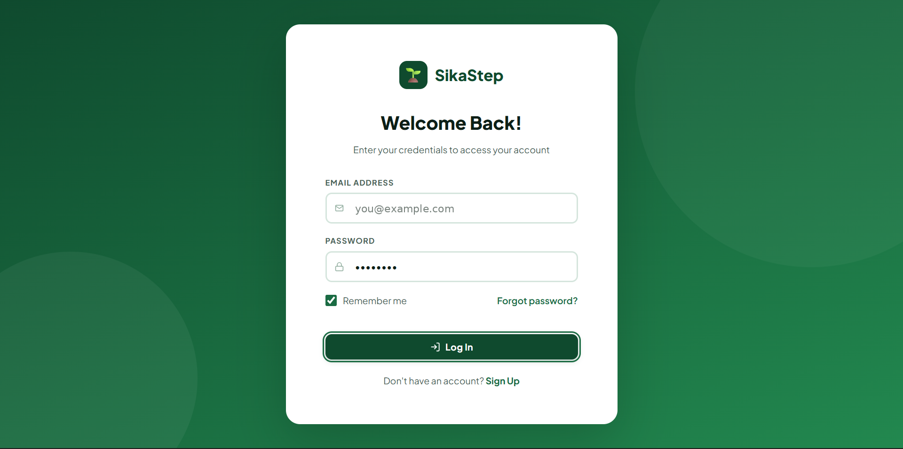
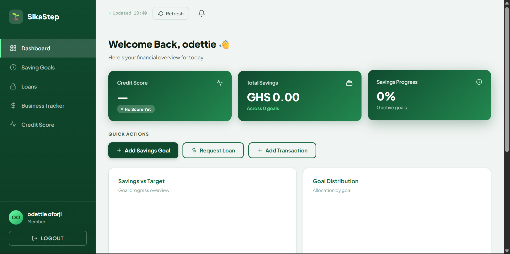
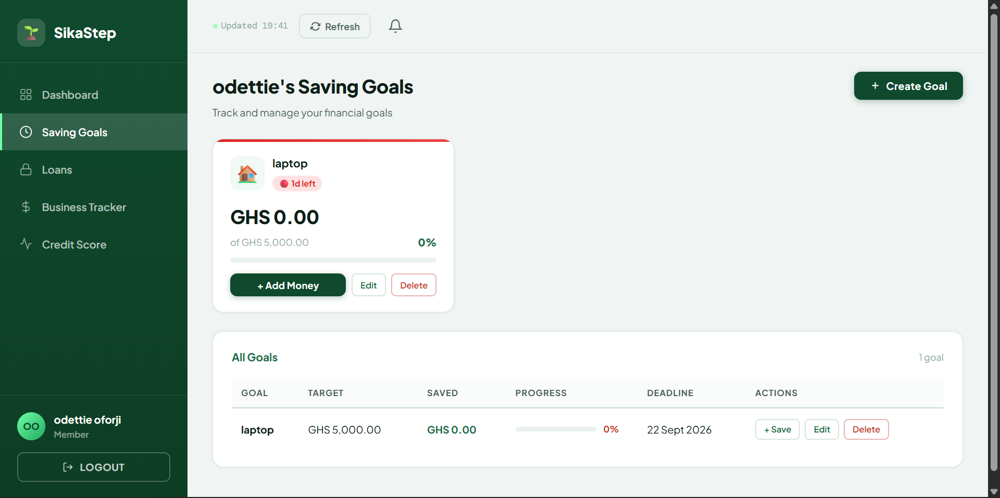
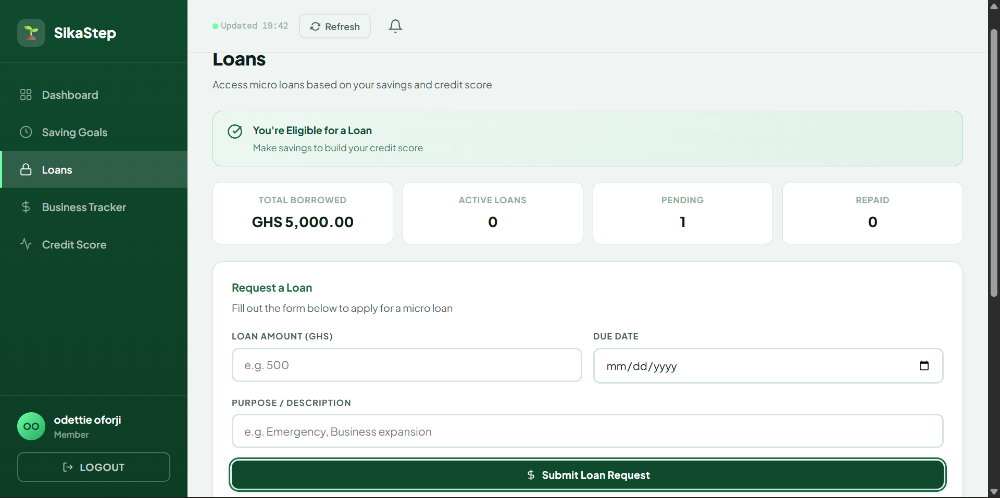
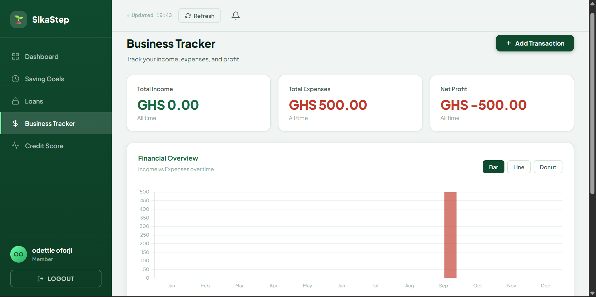
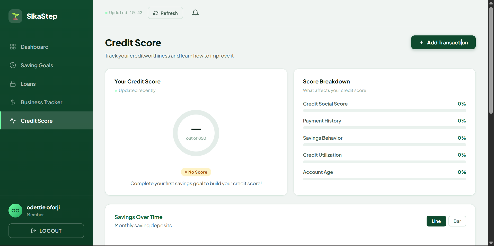

# SikaStep


A fintech web app for savings and financial management, built for low-to-middle income users in Ghana. SikaStep brings savings goals, business profit tracking, loan requests and credit scoring into one dashboard, with an admin panel for managing users and approving loans.

---

## Table of Contents

- [Problem Solved](#problem-solved)
- [Features](#features)
- [Screenshots](#screenshots)
- [Tech Stack](#tech-stack)
- [Data Model](#data-model)
- [Project Structure](#project-structure)
- [API Endpoints](#api-endpoints)
- [Getting Started](#getting-started)
- [Deployment](#deployment)
- [Background](#background)
- [Developer](#developer)
- [License](#license)

---

## Problem Solved

Many individuals and small business owners in Ghana have no simple way to:

- Save towards a specific goal and see their progress
- Keep track of business income and profit
- Build a credit history that helps them access loans

SikaStep puts all of this in one place, and gives administrators the tools to review loan requests and manage users.

---

## Features

### User Dashboard

- **Saving goals:** create, edit and delete goals with a target amount and deadline, and add money to a goal as you save
- **Contribution tracking:** every deposit is recorded as a transaction that can be edited later
- **Business tracker:** log business transactions and track profit
- **Loans:** request micro loans based on your savings and credit score, and follow their status (pending, approved or rejected), with due dates and repayments
- **Credit score:** view your score on a 300 to 850 scale, with a breakdown of what affects it
- **Charts:** bar, line and donut charts powered by Chart.js for income vs expenses, savings vs target and more

### Authentication

- Register, log in and log out
- Session-based authentication
- Admin-only routes protected by middleware
- Suspended accounts are blocked by the account status field

### Admin Panel

| Section | What admins can do |
|---------|--------------------|
| Dashboard Overview | See totals for users, goals, savings and pending loans |
| User Management | Promote or demote admins, suspend or activate accounts, delete users |
| Loan Management | Approve or reject loan requests |
| Saving Goals | View all goals across users |
| Transactions | View all saving transactions |
| Activity Logs | Review recent activity |

---

## Screenshots

<table>
  <tr>
    <td align="center"><b>Login</b><br></td>
    <td align="center"><b>Dashboard</b><br></td>
  </tr>
  <tr>
    <td align="center"><b>Saving Goals</b><br></td>
    <td align="center"><b>Loans</b><br></td>
  </tr>
  <tr>
    <td align="center"><b>Business Tracker</b><br></td>
    <td align="center"><b>Credit Score</b><br></td>
  </tr>
</table>

---

## Tech Stack

| Layer | Technologies |
|-------|--------------|
| Backend | Laravel 12, PHP 8.2+, Eloquent ORM, Laravel Sanctum, RESTful API |
| Database | SQLite for local development, MySQL or PostgreSQL in production |
| Frontend | HTML, CSS, JavaScript, Chart.js |
| DevOps | Docker (Apache), Render |

---

## Data Model

| Table | Purpose |
|-------|---------|
| `users` | Accounts, with `is_admin`, `status` and `last_login_at` |
| `saving_goals` | Goal name, target amount and deadline per user |
| `saving_transactions` | Deposits made towards a goal |
| `credit_scores` | Credit score per user (300 to 850) |
| `loan_requests` | Amount, due date and status (`pending`, `approved`, `rejected`) |
| `loan_repayments` | Repayments made against a loan request |
| `business_transactions` | Business income and expense records |
| `business_profit_trackers` | Profit amount linked to a business transaction |

Deleting a user cascades to all of their related records.

---

## Project Structure

```text
sikastep/
├── app/
│   ├── Http/
│   │   ├── Controllers/
│   │   │   ├── BusinessProfitTrackerController.php
│   │   │   ├── BusinessTransactionController.php
│   │   │   ├── CreditScoreController.php
│   │   │   ├── LoanRepaymentController.php
│   │   │   ├── LoanRequestController.php
│   │   │   ├── SavingGoalController.php
│   │   │   └── SavingTransactionController.php
│   │   └── Middleware/
│   │       ├── AdminMiddleware.php
│   │       └── Cors.php
│   └── Models/                 # One Eloquent model per table
├── database/
│   ├── factories/
│   ├── migrations/
│   └── seeders/
├── public/
│   ├── index.html              # User dashboard
│   ├── admin-login.html        # Admin sign in
│   └── admin-panel.html        # Admin panel
├── routes/
│   ├── api.php                 # REST API
│   └── web.php                 # Serves the HTML pages
├── Dockerfile
├── render.yaml
└── railway.json
```

---

## API Endpoints

### Authentication

| Method | Endpoint | Description |
|--------|----------|-------------|
| POST | `/api/register` | Create an account |
| POST | `/api/login` | Log in |
| POST | `/api/logout` | Log out |
| GET | `/api/check-session` | Check the current session |

### Resources

Each resource supports the standard REST actions (list, create, show, update, delete).

| Endpoint | Resource |
|----------|----------|
| `/api/saving-goals` | Saving goals |
| `/api/saving-transactions` | Saving transactions |
| `/api/loan-requests` | Loan requests |
| `/api/loan-repayments` | Loan repayments |
| `/api/credit-scores` | Credit scores |
| `/api/business-transactions` | Business transactions |
| `/api/business-profit` | Business profit tracker |

### Admin

These routes require an admin account.

| Method | Endpoint | Description |
|--------|----------|-------------|
| GET | `/api/admin/dashboard` | Overview totals |
| GET | `/api/admin/users` | List users |
| PUT | `/api/admin/users/{id}/make-admin` | Promote to admin |
| PUT | `/api/admin/users/{id}/remove-admin` | Remove admin rights |
| PUT | `/api/admin/users/{id}/suspend` | Suspend a user |
| PUT | `/api/admin/users/{id}/activate` | Reactivate a user |
| DELETE | `/api/admin/users/{id}` | Delete a user |
| GET | `/api/admin/loans` | List loan requests |
| PUT | `/api/admin/loans/{id}/approve` | Approve a loan |
| PUT | `/api/admin/loans/{id}/reject` | Reject a loan |
| GET | `/api/admin/goals` | List all saving goals |
| GET | `/api/admin/transactions` | List all transactions |
| GET | `/api/admin/logs` | Activity logs |

---

## Getting Started

### Requirements

- PHP 8.2 or higher
- Composer

### Installation

```bash
git clone https://github.com/CHI-coded/sikastep.git
cd sikastep

composer install
cp .env.example .env
php artisan key:generate

touch database/database.sqlite
php artisan migrate --seed

php artisan serve
```

Then open `http://127.0.0.1:8000`.

The seeder creates 5 sample users with goals, transactions, loans, repayments and a credit score each.

### Creating an admin account

1. Register a normal account on the site.
2. Open Tinker with `php artisan tinker` and run:

```php
App\Models\User::where('email', 'you@example.com')->update(['is_admin' => 1]);
```

3. Log in at `/admin-login`.

---

## Deployment

The project includes a `Dockerfile` (PHP 8.2 with Apache, listening on port 8080) with both MySQL and PostgreSQL drivers installed. To deploy on a platform like Render, build from the Dockerfile and set your production database credentials as environment variables.

---

## Background

SikaStep was built during my software development internship at GIT Plus Limited through Internship Ghana, where I worked on the backend: database design, migrations and models, REST APIs, authentication, the admin panel and deployment.

---

## Developer

**CHI-coded** on [GitHub](https://github.com/CHI-coded)

---

## License

This project is for educational and portfolio purposes.
